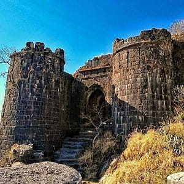
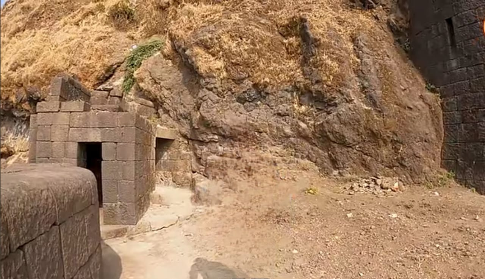
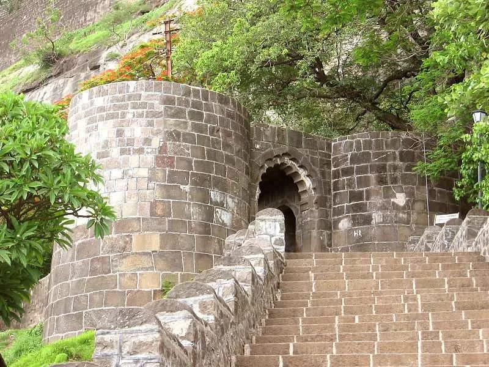
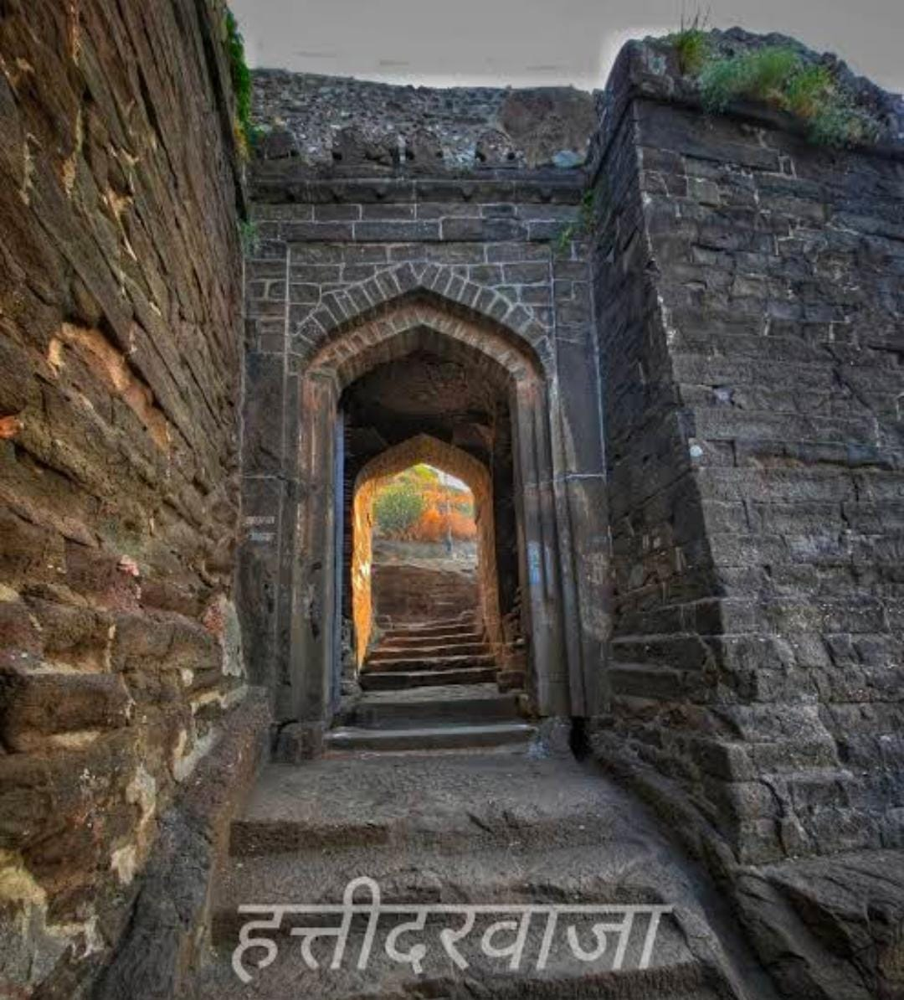
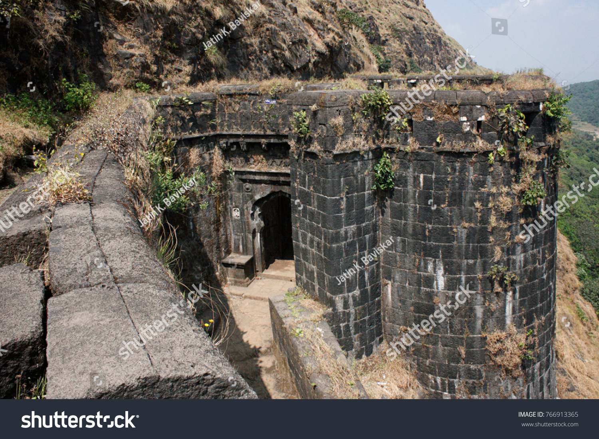
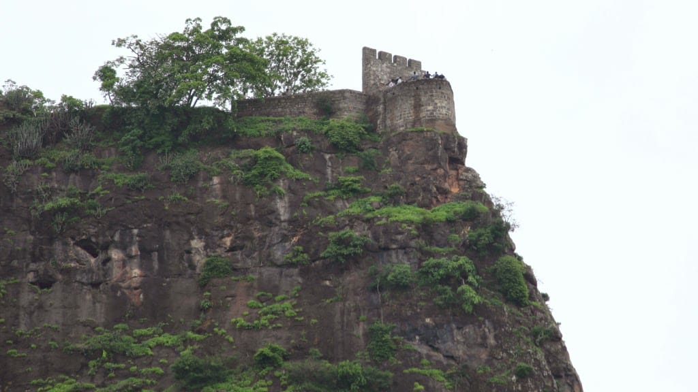
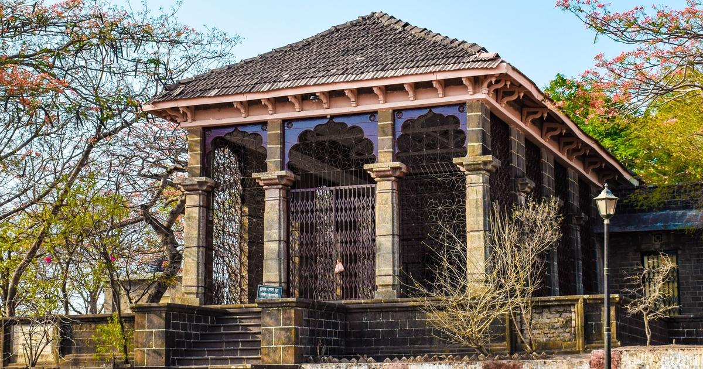

<!DOCTYPE html>
<html lang="mr">
<head>
  <meta charset="UTF-8" />
  <meta name="viewport" content="width=device-width, initial-scale=1.0"/>
  <title>Historical Fort Guide</title>
  <link rel="stylesheet" href="style.css"/>

  <Language Switcher Dropdown ></Language>
<select id="languageSwitcher" style="position: fixed; top: 10px; right: 10px; z-index: 1000;">
  <option value="mr">मराठी</option>
  <option value="en">English</option>
</select>

</head>
<body>
  <header>
    <nav>
      
शिलेदार

      <ul class="nav-links">
        <li><a href="#home">मुखपुष्ट </a></li>
        <li><a href="#locations">बघण्यासारखी ठिकाणे </a></li>
        <li><a href="#history">इतिहास </a></li>
        <li><a href="#gallery">छायाचित्रे</a></li>
      </ul>
    </nav>
  </header>

  <main>
    <section id="home" class="hero">
      <h1>शिवनेरी गडावर आपले स्वागत आहे......</h1>
      
प्राचीन किल्ल्याचा समृद्ध इतिहास आणि वास्तुकला अनुभवा......

      
    </section>

    <section id="locations" class="locations">
      <h2>गडावरील ऐतिहासिक वास्तू</h2>
      

        

          
          <a href="buruj.html"><h3>बुरुज </h3></a>
          
बुरुज म्हणजे किल्ल्याच्या तटबंदीवर बांधलेले उंच संरक्षक मनोरे...

        

        

          
          <a href="chordarvaja.html"><h3>शौचालय व चोरवाट </h3></a>
          
पूर्वीच्या काळात देखील सैनिकांसाठी शौचालय होते...

        

        

          
          <a href="alldoors.html"><h3> महादरवाजा</h3></a>
          
हा गडाचा मुख्य दरवाजा आहे...

        

        

          
          <a href="alldoors.html"><h3>हत्तीदरवाजा </h3></a>
          
हत्तीदरवाजा हा किल्ल्याच्या मुख्य प्रवेशद्वारांपैकी एक आहे...

        

        

          
          <a href="alldoors.html"><h3>गणेश दरवाजा</h3></a>
          
हा सर्वात प्राचीन दरवाजा आहे...

        

        

          
          <a href="shivai mandir.html"><h3>शिवाई देवी मंदिर </h3></a>
          
हे मंदिर खास महत्त्वाचे ठरते कारण...

        

        

          
          <a href="badami take.html"><h3>बदामी टाके</h3></a>
          
शिवनेरी किल्ल्यावर असलेली एक प्राचीन जलसंचय व्यवस्था...

        

        

          
          <a href="kadelot.html"><h3>कडेलोट </h3></a>
          
"कडेलोट" म्हणजे गुन्हेगार किंवा शत्रूला किल्ल्याच्या कड्यावरून फेकण्याची शिक्षा...

        

        

          
          <a href="Shivkunj.html"><h3>शिवकुंज</h3></a>
          
शिवनेरी किल्ल्यावर बालशिवाजी आणि जिजाऊ यांच्या सुंदर मूर्ती आहेत...

        

        

          
          <a href="janmsthan.html"><h3>छत्रपती शिवाजी महाराजांचे जन्मस्थान</h3></a>
          
१९ फेब्रुवारी १६३० रोजी शिवाजी महाराजांचा जन्म याच गडावर झाला...

        

      

    </section>

    <section id="history" class="history">
      <h2>गडाचा इतिहास</h2>
      

        
शिवनेरी गड हा सातवाहन कालखंडातही महत्त्वाचा होता...
 
        <a href="history.html" class="timeline-link">
          <h3>अधिक जाणून घेण्यासाठी येथे क्लिक करा..</h3>
        </a>
      

    </section>

     

    <section id="gallery" class="gallery">
      <h2> छायाचित्रे </h2>
      

        

        

        
        
      

    </section>
    
    <!-- ✅ Google Translate Dropdown (Top Right Corner) -->
  

  

  

  </main>

  
  <footer>
    
&copy; 2024 Historical Fort Guide. All rights reserved.

  </footer>

  
 
</body>
</html>
